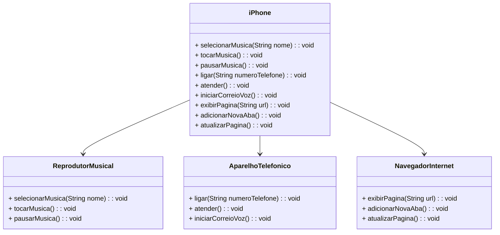

# BOOTCAMP DIO - Bradesco - Java Cloud Native

## Índice
- [Descrição](#descrição)
- [Funcionalidades](#funcionalidade)
- [Diagrama UML](#diagrama-uml)
- [Tecnologias](#tecnologias)

## Descrição
### Desafio de Projeto: Modelando o iPhone com UML - Funções de Música, Chamadas e Internet
O objetivo deste projeto é aplicar os conceitos e ferramentas aprendidas no módulo de Programação Orientada a Objetos do Bootcamp "Bradesco - Java Cloud Native".

## Funcionalidade

O projeto consiste em implementar as interfaces de `Reprodutor de Música`, `Aparelho Telefônico` e `Navegador de Internet` na classe `iPhone`.

Cada interface possui três funções que devem ser implementadas:

1. **Reprodutor de Música:**
   - `tocar()`
   - `pausar()`
   - `selecionarMusica(String musica)`

2. **Aparelho Telefônico:**
   - `ligar(String numero)`
   - `atender()`
   - `iniciarCorreioVoz()`

3. **Navegador de Internet:**
   - `exibirPagina(String url)`
   - `adicionarNovaAba()`
   - `atualizarPagina()`

## Diagrama UML

## Tecnologias

Aqui você pode listar as tecnologias usadas no projeto, por exemplo:
- Java 17
- UML
  
